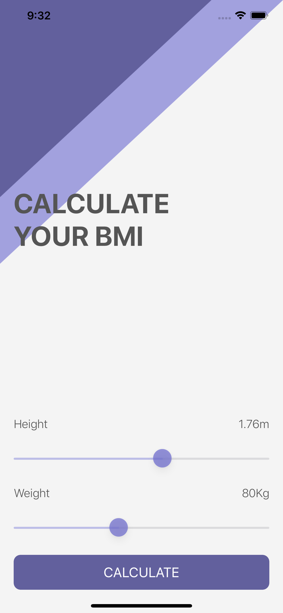
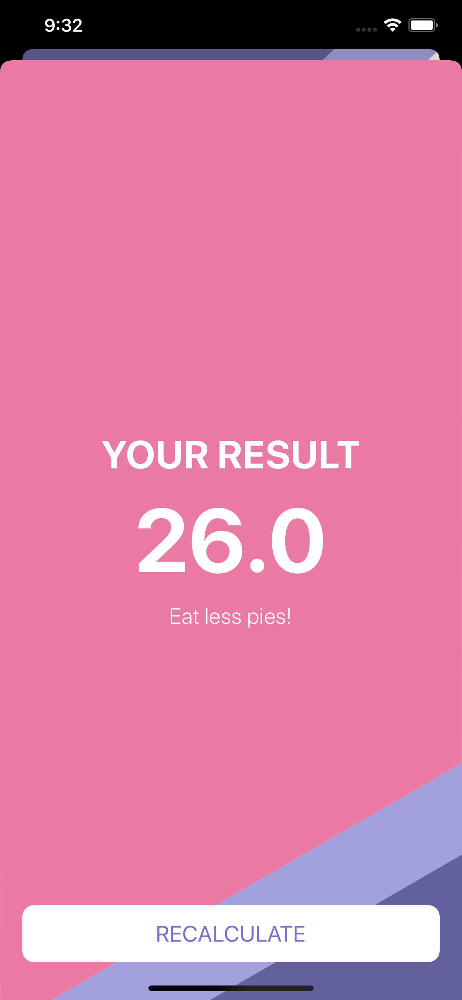

## BMI-App-Xcode
It is a mediocre BMI calculator app with basic functionalities.

## Motivation
It is a personal project developed by me in Xcode using Swift5. It is basically developed for learning new skill in Xcode by having a overview on the language and implementing the experience.

## Tech/framework used

<b>Built with</b>
- [Xcode](https://developer.apple.com/xcode/)
- [Swift5](https://swift.org/blog/swift-5-released/)

## Screenshots

## Contribute
I'm welcome to any ideas to contribute.

## License
[MIT](https://choosealicense.com/licenses/mit/)
